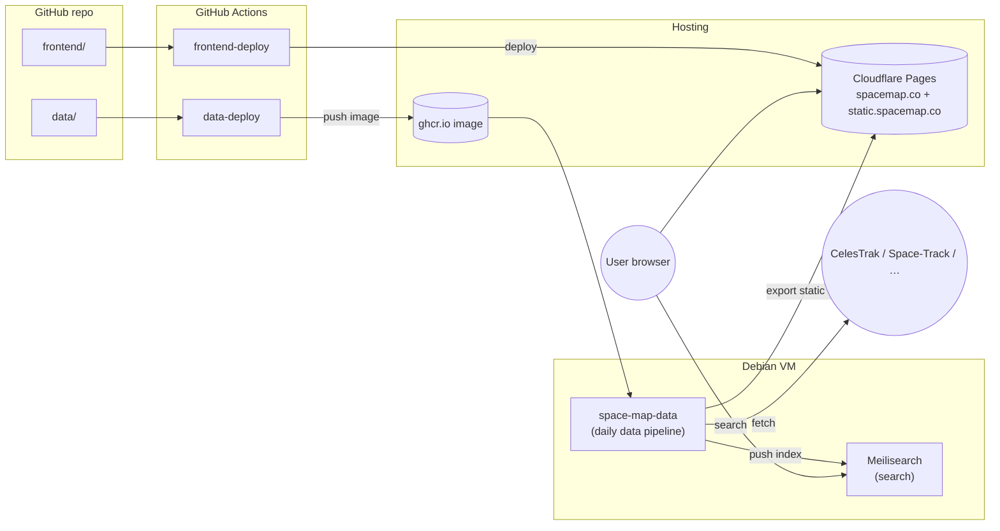

# Space Map

Space Map is a real-time, real-scale, fully continuous map of the solar system, mapping 1,555,232 objects and 16,074 surface features as of 2026-06-20.

## Features

Space Map computes the positions of these objects at any date, using orbital elements from NASA, ESA, JAXA, and the US space force:

| Type | Count | Source |
| --- | --- | --- |
| Planets | 8 | [NASA SPICE kernels (NAIF)](https://naif.jpl.nasa.gov/naif/) |
| Dwarf planets | 10 | [NASA JPL Horizons](https://ssd.jpl.nasa.gov/horizons/) |
| Moons | 466 | [NASA JPL Horizons](https://ssd.jpl.nasa.gov/horizons/) |
| Asteroids | 1,519,013 | [Small-Body Database](https://ssd.jpl.nasa.gov/tools/sbdb_lookup.html) |
| Comets | 4,082 | [Small-Body Database](https://ssd.jpl.nasa.gov/tools/sbdb_lookup.html) |
| Spacecraft | 19,219 | [CelesTrak](https://celestrak.org/), [Space-Track](https://www.space-track.org/), NASA ([JPL Horizons](https://ssd.jpl.nasa.gov/horizons/), [NAIF](https://naif.jpl.nasa.gov/naif/), [PDS](https://pds.nasa.gov/)), [ESA SPICE Service](https://www.cosmos.esa.int/web/spice), [JAXA DARTS](https://darts.isas.jaxa.jp/) |
| Satellite debris | 12,423 | [CelesTrak](https://celestrak.org/), [Space-Track](https://www.space-track.org/) |
| Surface features | 16,074 | [Gazetteer of Planetary Nomenclature (IAU/USGS/NASA)](https://planetarynames.wr.usgs.gov/) |

Each of these is displayed at its current position, and shown at its real size (when known). Most asteroids, comets, and earth sats are displayed as points, but they're all clickable.

- Time control: Speed up or reverse time, go to any date.
- Collections: See all [Starlink](https://spacemap.co/g/const-starlink), [GPS](https://spacemap.co/g/const-gps) satellites, [Geostationary orbit](https://spacemap.co/g/class-GEO), the [Jupiter Trojan asteroids](https://spacemap.co/g/class-TJN/Jupiter%20Trojan?at=now,34.60900,58.08478,131.68).
- Search: Text search & filters.
- Historical positions for earth satellites from 2004.
- Over 100 spacecraft with 3D models: [ISS](https://spacemap.co/e/25544/International%20Space%20Station?at=now,-18.39666,1.9643e-9), [Hubble](https://spacemap.co/e/20580/Hubble%20Space%20Telescope?at=now,19.83363,-95.19624,1.9914e-9), [James Webb](https://spacemap.co/p/115347456/James%20Webb%20Space%20Telescope?at=now,54.61394,115.76731,1.9039e-9), [Juno](https://spacemap.co/p/107159552/Juno?at=2022-08-17T15:29:50.557Z,64.88818,-21.50912,1.0027e-9), [Cassini](https://spacemap.co/p/88592384/Cassini?at=2013-07-09T06:37:40.977Z,63.94176,-121.21263,2.1247e-9), [New Horizons](https://spacemap.co/p/104804352/New%20Horizons?at=2015-07-14T11:30:05.310Z,64.31879,-172.33606,4.7916e-9), [Voyager 2](https://spacemap.co/p/49000448/Voyager%202?at=1989-08-25T02:58:36.961Z,76.62626,0.66449,1.4615e-9).
- Textures for all planets, 22 moons, and 5 minor planets.
- Images from Wikimedia Commons, descriptions from Wikipedia.
- Deep links: Easily share what you're looking at.
- Localization: Full localization in 6 languages from wikipedia (UI elements were localized by Claude Opus 4.8 & Fable 5).
- Performance: Load a solar system faster than your bank can show you your balance.

## Architecture

Space Map has a hybrid serverless/bare metal on-premise architecture, allowing high performance and low cost.

Data endpoints are exported as static files served by Cloudflare pages. This allows high performance & low maintenance overhead. The exception is the search engine, which runs on a baremetal server.

The export pipeline compresses orbital elements from ~100GiB down to 1.6GiB, and splits them in chunks so the frontend can propagate the current position quickly. The loss in accuracy is significant, but very small for major objects: [planets, moons, and important small objects](docs/chebyshev-accuracy.md) and [spacecraft](docs/probe-accuracy.md) are typically off by meters to hundreds of meters.

## Other space maps

- [NASA's Eyes](https://science.nasa.gov/eyes/) - NASA's map of the solar system & nearby stars
- [celestrak.keeptrack.space](https://celestrak.keeptrack.space/) - Earth satellites
- [stuffin.space](https://stuffin-space.vader.zone/) - Earth satellites, live
- [satellitemap.space](https://satellitemap.space/) - Earth satellites, live
- [If the moon were one pixel](https://joshworth.com/dev/pixelspace/pixelspace_solarsystem.html)
