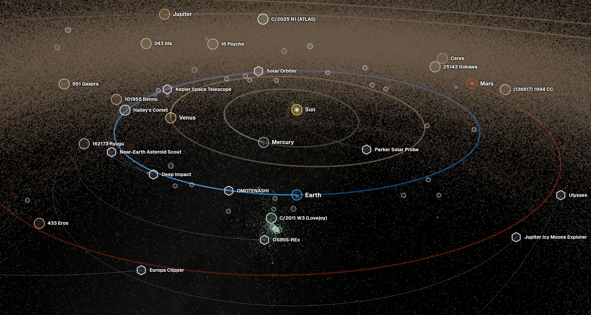
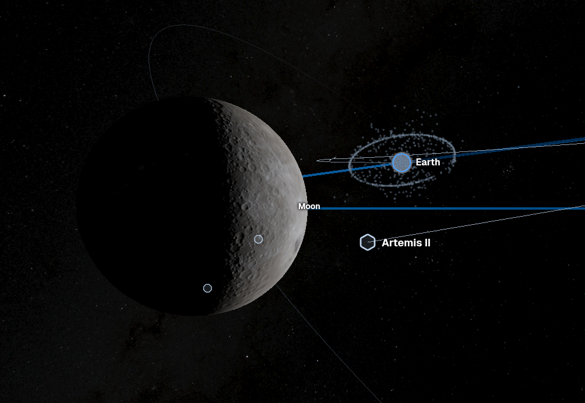
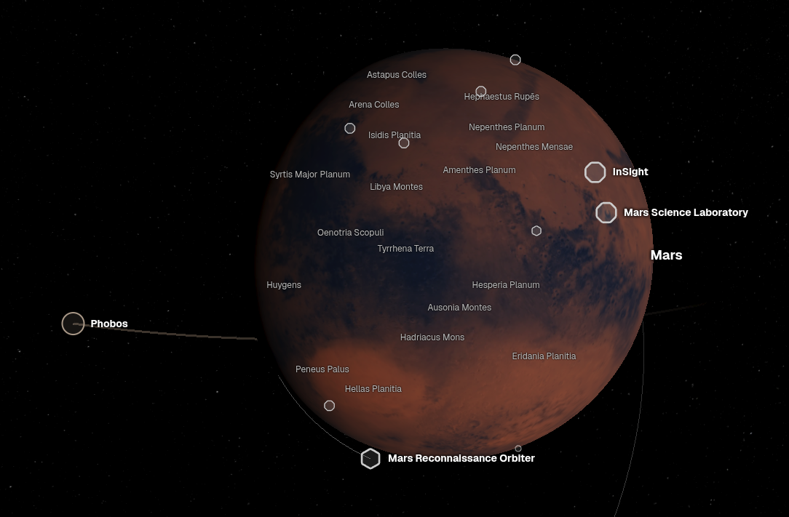
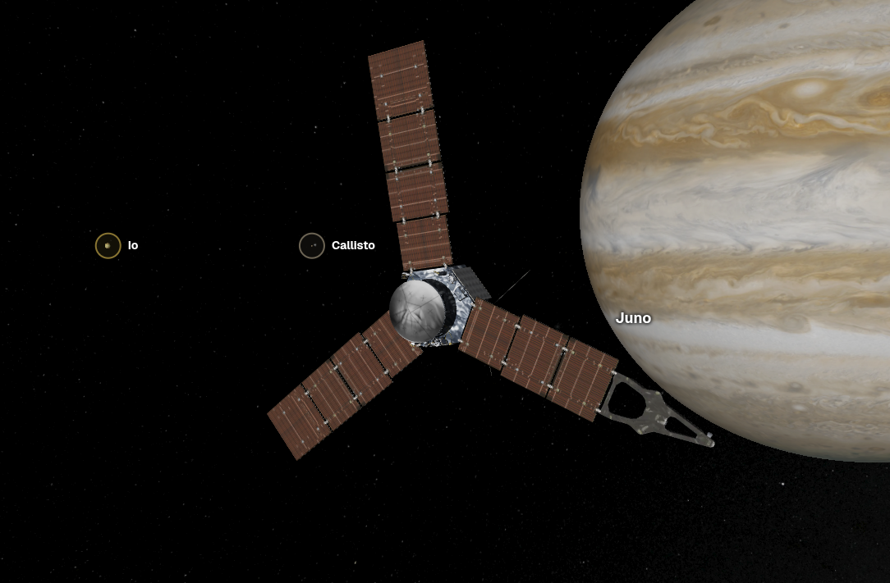
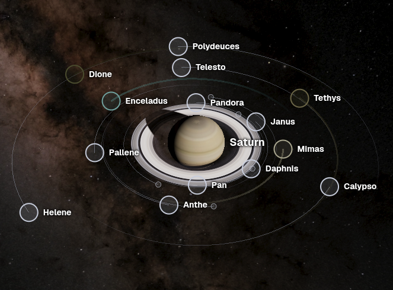

# Space Map

Space Map is a real-time, real-scale, fully continuous map of the solar system, mapping 1.6m objects and 16k surface features as of July 2026.

|  |  |
|:-:|:-:|
|  |  |

Click the images to open

## Features

Space Map computes positions at any date, using orbital elements from NASA, ESA, JAXA, and the US Space Force:

| Type | Count | Source |
| --- | --- | --- |
| Planets | 8 | [NASA SPICE kernels (NAIF)](https://naif.jpl.nasa.gov/naif/) |
| Dwarf planets | 10 | [NASA JPL Horizons](https://ssd.jpl.nasa.gov/horizons/) |
| Moons | 466 | [NASA JPL Horizons](https://ssd.jpl.nasa.gov/horizons/) |
| Asteroids | 1.5m | [Small-Body Database](https://ssd.jpl.nasa.gov/tools/sbdb_lookup.html) |
| Comets | 4k | [Small-Body Database](https://ssd.jpl.nasa.gov/tools/sbdb_lookup.html) |
| Spacecraft | 27k | [CelesTrak](https://celestrak.org/), [Space-Track](https://www.space-track.org/), NASA ([JPL Horizons](https://ssd.jpl.nasa.gov/horizons/), [NAIF](https://naif.jpl.nasa.gov/naif/), [PDS](https://pds.nasa.gov/)), [ESA SPICE Service](https://www.cosmos.esa.int/web/spice), [JAXA DARTS](https://darts.isas.jaxa.jp/) |
| Satellite debris | 40k | [CelesTrak](https://celestrak.org/), [Space-Track](https://www.space-track.org/) |
| Surface features | 16k | [Gazetteer of Planetary Nomenclature (IAU/USGS/NASA)](https://planetarynames.wr.usgs.gov/) |

Each of these is displayed at its current position, and shown at its real size (when known). Click any object to focus it.

- Time control: Speed up or reverse time, go to any date.
- Collections: See all [Starlink](https://spacemap.co/g/const-starlink), [GPS](https://spacemap.co/g/const-gps), [Geostationary](https://spacemap.co/g/class-GEO) satellites, the [Jupiter Trojan asteroids](https://spacemap.co/g/class-TJN/Jupiter%20Trojan?at=now,34.60900,58.08478,131.68), [hyperbolic comets](https://spacemap.co/g/class-HYP/Hyperbolic%20Comet?at=now,20.47956,140.22461,42.430).
- Search: Text search & filters, infinite scroll - it's 2026, time to doomscroll [potentially hazardous asteroids](https://spacemap.co/b/399?f=pha).
- Historical positions for earth satellites & probes from [1959](https://spacemap.co/b/399/Earth?at=1959-06-30T23:46:01.557Z,42.14541,151.20487,0.0023256). Coverage is limited for early & non-US/EU/JA spacecraft.
- Over 250 spacecraft with 3D models: [ISS](https://spacemap.co/e/25544/International%20Space%20Station?at=now,35.24905,-17.25253,1.3451e-8), [Hubble](https://spacemap.co/e/20580/Hubble%20Space%20Telescope?at=now,19.83363,-95.19624,1.9914e-9), [James Webb](https://spacemap.co/p/115347456/James%20Webb%20Space%20Telescope?at=now,54.61394,115.76731,1.9039e-9), [Juno](https://spacemap.co/p/107159552/Juno?at=2022-08-17T15:29:50.557Z,64.88818,-21.50912,1.0027e-9), [Cassini](https://spacemap.co/p/88592384/Cassini?at=2013-07-09T06:37:40.977Z,63.94176,-121.21263,2.1247e-9), [New Horizons](https://spacemap.co/p/104804352/New%20Horizons?at=2015-07-14T11:30:51.731Z,45.06167,34.07062,8.5505e-10), [Voyager 2](https://spacemap.co/p/49000448/Voyager%202?at=1989-08-25T02:58:36.961Z,76.62626,0.66449,1.4615e-9).
- Textures for all planets, 25 moons, and 14 minor bodies; 3d models for 11k [asteroids](https://spacemap.co/s/20101955/101955%20Bennu?at=now,-0.99190,142.87246,4.7560e-8), [comets](https://spacemap.co/s/1000012/67P%2FChuryumov%E2%80%93Gerasimenko?at=now,48.95132,65.96561,3.7911e-7), and [moons](https://spacemap.co/b/618/Pan?at=now,20.79260,41.75821,0.0000048744); colors for 2k small bodies from [TrueColorTools](https://github.com/Askaniy/TrueColorTools).
- System-scale lighting with [accurate eclipses](https://spacemap.co/b/399/Earth?at=2027-08-02T10:00:00.000Z,28.17996,30.91585,0.00082651), [self-shadowing](https://spacemap.co/b/301/Moon?at=now,15.74410,-121.08716,0.00026972).
- Deep links: Easily share what you're looking at.
- Images from Wikimedia Commons for 4k objects, descriptions from Wikipedia for 64k. Metadata from Wikidata and [Jonathan C. McDowell's GCAT](https://planet4589.org/space/gcat/index.html).
- Localization: Full localization in 12 languages, with content from Wikipedia. UI elements were localized by Claude Opus 4.8 & Fable 5.
- Credits & sources: see full attributions in the [credits page](https://spacemap.co/credits).
- Performance: Load a solar system faster than your bank can show you your balance.
- Easter eggs: I won't spoil them for you.

## Architecture

Space Map's frontend is built with SvelteKit and Three.js (WebGL), and is hosted on Cloudflare Workers. The positions for most asteroids & comets are computed in web workers: that's what makes real-time positions possible with 1.6m objects.

The data pipeline is built in Python. It downloads each dataset, joins them in a SQLite database, and exports them to static files. Those static files are served as static Cloudflare Workers assets: there's no backend for most of the app. This has drawbacks, but allows serving lots of data very fast, at very low cost. In particular, maintenance is very easy: all "endpoints" are served once, so there's no risk of runtime backend errors. The export format is [documented (written by AI)](docs/export-format/README.md). Search is provided by a Meilisearch database running in a VPS.

### Positions

The export pipeline compresses orbital elements from ~100GiB down to 1.9GiB, and splits them in chunks so the frontend can propagate the current position quickly. The loss in accuracy is significant, but very small for major objects: [planets, moons, and important small objects](docs/chebyshev-accuracy.md), and [spacecraft](docs/probe-accuracy.md) are typically off by meters to hundreds of meters compared to high-accuracy tracking data.

Sources for these major objects are [spice kernels](https://en.wikipedia.org/wiki/SPICE_(observation_geometry_system)), which can contain tracking data at regular intervals. This is great for irregular orbits, but scales with shorter orbital period. A satellite in low orbit will take a lot of space, but those orbits tend to be stable. The pipeline will convert this heavy format into light keplerian elements, including precession when it results in an accuracy improvement. Those elements do go stale, the pipeline time-chunks elements. The results are very good: the Mars Reconnaissance Orbiter (MRO) goes from 10GiB to ~0.28 MiB, with a P95 accuracy loss of [only 134.4km](docs/probe-accuracy.md) at the edge of chunks (worst case). Not science grade, but good enough for visualization.

Important objects (famous probes, planets, major moons) have a higher size budget, so their positions will be more accurate.

For earth satellites, positions are computed with [SGP4](https://en.wikipedia.org/wiki/Simplified_perturbations_models) with [satellites.js](https://github.com/shashwatak/satellite-js). Orbital elements are exported weekly from the [US Space Force](https://www.space-track.org), with a historical archive from [1959](https://spacemap.co/b/399/Earth?at=1959-06-30T23:46:01.557Z,42.14541,151.20487,0.0023256).

Orbital elements for Asteroids & comets are retrieved from the [JPL Small-Body Database](https://ssd.jpl.nasa.gov/tools/sbdb_lookup.html#/), which only provides static current orbital elements. Positions for these 1.5m objects will be less accurate the further from the current date you go.

## Other space maps

- [NASA's Eyes](https://science.nasa.gov/eyes/) - NASA's map of the solar system & nearby stars
- [celestrak.keeptrack.space](https://celestrak.keeptrack.space/) - Earth satellites
- [stuffin.space](https://stuffin-space.vader.zone/) - Earth satellites, live
- [satellitemap.space](https://satellitemap.space/) - Earth satellites, live
- [Google Maps Space](https://www.google.com/maps/space/mars) - Planets & moons, not continuous
- [If the moon were one pixel](https://joshworth.com/dev/pixelspace/pixelspace_solarsystem.html) - 1D map of the solar system
- [Space Engine](https://spaceengine.org/), [Celestia](https://celestiaproject.space/), [Universe Sandbox](https://store.steampowered.com/app/230290/Universe_Sandbox/): universe simulators with desktop/mobile apps
- [Kerbal Space Program](https://www.kerbalspaceprogram.com/)'s orbit map was the original inspiration for this project
