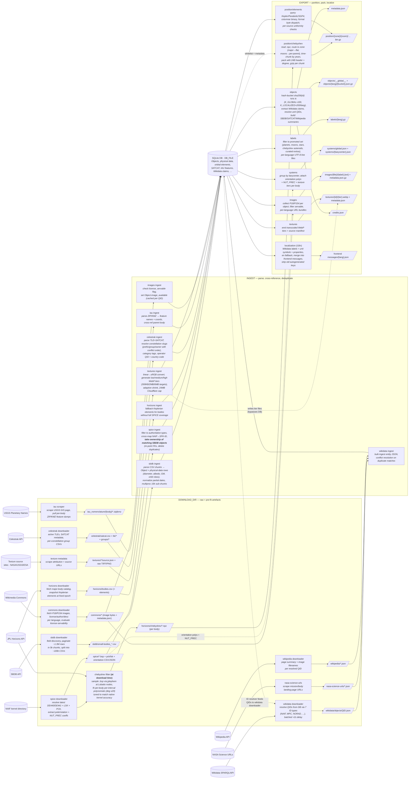

[//]: # (Time flows top → bottom; processing flows left → right.)

```mermaid
flowchart LR
    %% ─────────────────────────────────────────────────────────────
    %% External sources (raw, upstream)
    %% ─────────────────────────────────────────────────────────────
    SBDB[(SBDB API)]
    HORIZONS[(JPL Horizons API)]
    NAIF[(NAIF kernel directory)]
    CELESTRAK[(Celestrak API)]
    WIKIDATA[(Wikidata SPARQL/API)]
    WIKIPEDIA[(Wikipedia API)]
    COMMONS[(Wikimedia Commons)]
    IAU[(USGS Planetary Names)]
    NASA[(NASA Science URLs)]
    TEX_SRC[(Texture source sites&nbsp;·&nbsp;NASA/USGS/ESA)]

    %% ─────────────────────────────────────────────────────────────
    %% DOWNLOAD STAGE — fetch + on-the-fly transforms (DOWNLOAD_DIR)
    %% ─────────────────────────────────────────────────────────────
    subgraph DL["DOWNLOAD_DIR — raw + pre-fit artefacts"]
        direction TB

        D_SBDB["sbdb downloader<br/><i>field discovery, paginate ~1.3M rows<br/>in 5k chunks, split into ~100k CSVs</i>"]
        D_HOR["horizons downloader<br/><i>fetch major-body catalog,<br/>snapshot Keplerian elements at fixed epoch</i>"]
        D_SPK["spice downloader<br/><i>resolve latest DE440/DE441 + LSK + PCK,<br/>extract pole/rotation + NUT_PREC coeffs</i>"]
        D_CHEB["chebyshev fitter <b>(at download time)</b><br/><i>sample .bsp via jplephem at Lobatto nodes,<br/>fit per-body per-interval polynomials (deg ≤20)<br/>tuned to match native kernel accuracy</i>"]
        D_CEL["celestrak downloader<br/><i>active TLEs, SATCAT metadata,<br/>per-constellation group CSVs</i>"]
        D_WD["wikidata downloader<br/><i>resolve QIDs from DB via 7 ID types<br/>(NAIF, MPC, NORAD, …), batched +2s delay</i>"]
        D_WP["wikipedia downloader<br/><i>page summary + image filenames<br/>per resolved QID</i>"]
        D_IMG["commons downloader<br/><i>fetch P18/P154 images, license/author/desc<br/>per language, evaluate license-servability</i>"]
        D_IAU["iau scraper<br/><i>scrape USGS GIS page, pull per-body<br/>ZIP/KMZ feature dumps</i>"]
        D_NASA["nasa-science-urls<br/><i>scrape mission/body landing-page URLs</i>"]
        D_TEX["texture metadata<br/><i>scrape attribution + source URLs</i>"]

        F_SBDB[/"sbdb/small-bodies_*.csv"/]
        F_HOR[/"horizons/bodies.csv (+ elements)"/]
        F_SPK[/"spice/*.bsp + pck/lsk + orientation CSV/JSON"/]
        F_CHEB[/"horizons/chebyshev/*.npz (per body)"/]
        F_CEL[/"celestrak/satcat.csv + tle/* + groups/*"/]
        F_WD[/"wikidata/objects/QID.json"/]
        F_WP[/"wikipedia/*.json"/]
        F_IMG[/"commons/* (image bytes + metadata.json)"/]
        F_IAU[/"iau_nomenclature/{body}/*.zip|kmz"/]
        F_NASA[/"nasa-science-urls/*.json"/]
        F_TEX[/"textures/*/source.json + raw TIFF/PNG"/]

        D_SBDB --> F_SBDB
        D_HOR  --> F_HOR
        D_SPK  --> F_SPK
        D_SPK  --> D_CHEB
        D_CHEB --> F_CHEB
        D_CEL  --> F_CEL
        D_WD   --> F_WD
        D_WP   --> F_WP
        D_IMG  --> F_IMG
        D_IAU  --> F_IAU
        D_NASA --> F_NASA
        D_TEX  --> F_TEX
    end

    %% ─────────────────────────────────────────────────────────────
    %% INGEST STAGE — normalize, cross-reference, dedupe → DB
    %% ─────────────────────────────────────────────────────────────
    subgraph ING["INGEST — parse, cross-reference, deduplicate"]
        direction TB

        I_SBDB["sbdb ingest<br/><i>parse CSV chunks → Object + physical-data rows<br/>(diameter, albedo, GM, orbit class),<br/>normalize partial dates, multiproc 10k sub-chunks</i>"]
        I_SPICE["spice ingest<br/><i>filter to authoritative types,<br/>cross-map NAIF↔SPK-ID,<br/><b>take ownership of matching SBDB objects</b><br/>(re-point FKs, delete duplicates)</i>"]
        I_HOR["horizons ingest<br/><i>fallback Keplerian elements for bodies<br/>without full SPICE coverage</i>"]
        I_CEL["celestrak ingest<br/><i>parse TLE+SATCAT, resolve constellation slugs<br/>(prefix/group/owner with conflict order),<br/>category tags, operator QID + country code</i>"]
        I_WD["wikidata ingest<br/><i>bulk ingest entity JSON,<br/>conflict resolution on duplicate matches</i>"]
        I_IAU["iau ingest<br/><i>parse ZIP/KMZ → feature names + coords,<br/>cross-ref parent body</i>"]
        I_IMG["images ingest<br/><i>check license_servable flag,<br/>set Object.image_available (cached per QID)</i>"]
        I_TEX["textures ingest<br/><i>linear→sRGB convert, generate low/medium/high<br/>WebP tiers (300KB/2MB/6MB targets),<br/>adaptive shrink, 24MB Cloudflare cap</i>"]
    end

    DB[("SQLite DB · DB_FILE<br/><i>Objects, physical data, orbital elements,<br/>SATCAT, IAU features, Wikidata claims, …</i>")]

    %% ─────────────────────────────────────────────────────────────
    %% EXPORT STAGE — partition, bucket, pack, gzip → static files
    %% ─────────────────────────────────────────────────────────────
    subgraph EXP["EXPORT — partition, pack, localize"]
        direction TB

        E_POS_CHEB["position/chebyshev<br/><i>read .npz, route to zone (major→flat,<br/>moons→per-parent), time-chunk by years,<br/>pack with 24B header + degree, gzip per chunk</i>"]
        E_POS_EL["position/elements<br/><i>query Kepler/Parabolic/SGP4,<br/>columnar binary, format byte dispatch,<br/>per-source uniformity checks</i>"]
        E_OBJ["objects<br/><i>hash-bucket sha256(id) %% N<br/>(K_GLOBAL=100, K_LOCALIZED=200/lang),<br/>extract Wikidata claims, resolve unit QIDs,<br/>build SBDB/SATCAT/Wikipedia summaries</i>"]
        E_LBL["labels<br/><i>filter to promoted set (planets, moons, stars,<br/>chebyshev asteroids, curated extras),<br/>per-language UTF-8 line files</i>"]
        E_LOC["localization (i18n)<br/><i>Wikidata labels + unit symbols + properties,<br/>en fallback, merge into frontend messages,<br/>strip old autogenerated keys</i>"]
        E_SYS["systems<br/><i>group by barycenter, attach orientation polys<br/>+ NUT_PREC + texture tiers per body</i>"]
        E_IMG["images<br/><i>collect P18/P154 per object, filter servable,<br/>per-language URL bundles</i>"]
        E_TEX["textures<br/><i>emit transcoded WebP tiers + source manifest</i>"]

        OUT_META[/"metadata.json"/]
        OUT_POS[/"position/{zone}/{zoom}/…bin.gz"/]
        OUT_OBJ[/"objects/__global__ + objects/{lang}/{bucket}.json.gz"/]
        OUT_LBL[/"labels/{lang}.gz"/]
        OUT_SYS[/"systems/global.json + systems/{barycenter}.json"/]
        OUT_IMG[/"images/{file}/{label}.{ext} + metadata.json.gz"/]
        OUT_TEX[/"textures/{id}/{tier}.webp + metadata.json"/]
        OUT_CRED[/"credits.json"/]
        OUT_MSG[/"frontend messages/{lang}.json"/]

        E_POS_CHEB --> OUT_POS
        E_POS_EL   --> OUT_POS
        E_OBJ      --> OUT_OBJ
        E_LBL      --> OUT_LBL
        E_LOC      --> OUT_MSG
        E_SYS      --> OUT_SYS
        E_IMG      --> OUT_IMG
        E_TEX      --> OUT_TEX
        E_OBJ      --> OUT_CRED
        E_OBJ      --> OUT_META
    end

    %% ─────────────────────────────────────────────────────────────
    %% Edges: source → download
    %% ─────────────────────────────────────────────────────────────
    SBDB      --> D_SBDB
    HORIZONS  --> D_HOR
    HORIZONS  --> D_CHEB
    NAIF      --> D_SPK
    CELESTRAK --> D_CEL
    WIKIDATA  --> D_WD
    WIKIPEDIA --> D_WP
    COMMONS   --> D_IMG
    IAU       --> D_IAU
    NASA      --> D_NASA
    TEX_SRC   --> D_TEX

    %% ─────────────────────────────────────────────────────────────
    %% Edges: raw files → ingest → DB
    %% ─────────────────────────────────────────────────────────────
    F_SBDB --> I_SBDB --> DB
    F_SPK  --> I_SPICE --> DB
    F_HOR  --> I_HOR  --> DB
    F_CEL  --> I_CEL  --> DB
    F_WD   --> I_WD   --> DB
    F_IAU  --> I_IAU  --> DB
    F_IMG  --> I_IMG  --> DB
    F_NASA --> I_WD
    F_WP   --> I_WD

    %% Wikidata QID resolution reads existing DB IDs to know what to fetch
    DB -. "ID resolver feeds<br/>QIDs to wikidata downloader" .-> D_WD

    %% Textures ingest reads downloaded raw + writes WebP tiers directly
    F_TEX --> I_TEX
    I_TEX -. "writes tier files<br/>(bypasses DB)" .-> OUT_TEX
    I_TEX --> DB

    %% ─────────────────────────────────────────────────────────────
    %% Edges: DB → export
    %% ─────────────────────────────────────────────────────────────
    DB --> E_POS_EL
    DB --> E_OBJ
    DB --> E_LBL
    DB --> E_LOC
    DB --> E_SYS
    DB --> E_IMG
    DB --> E_TEX

    %% Chebyshev export reads pre-fit .npz directly (DB only used for whitelist/metadata)
    F_CHEB --> E_POS_CHEB
    DB -. "whitelist + metadata" .-> E_POS_CHEB

    %% SPICE orientation goes straight to systems export
    F_SPK -. "orientation polys + NUT_PREC" .-> E_SYS

    %% Commons image bytes flow to image export untouched (license-filtered via DB flag)
    F_IMG --> E_IMG
```
