| Name | Image |
| --- | --- |
| iss | [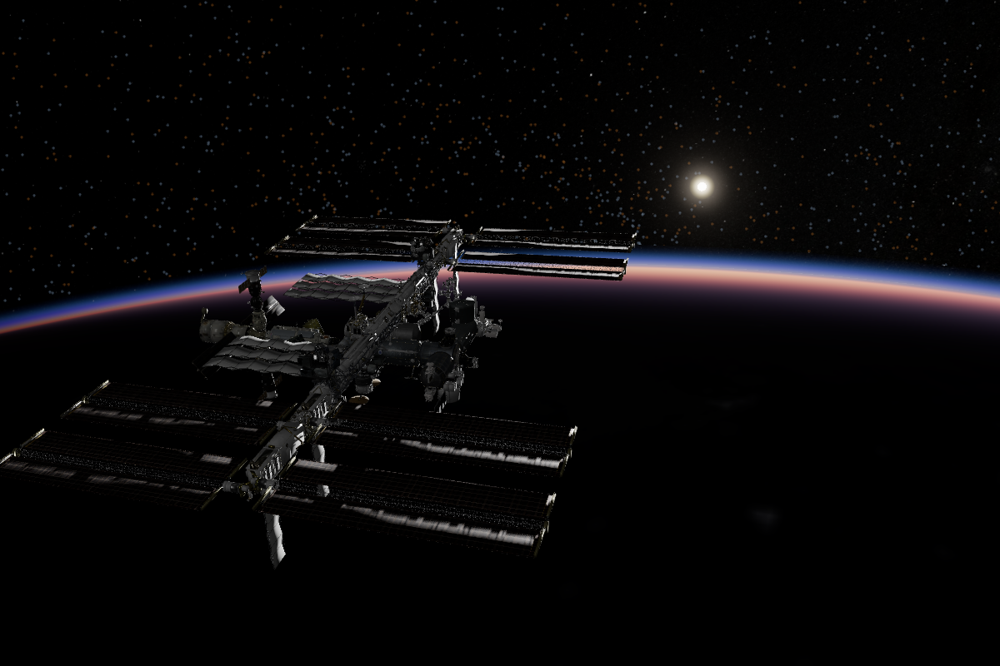](https://spacemap.co/e/25544/International%20Space%20Station?at=2026-07-08T22:38:33.108Z,10.5,36,8.69e-9) |
| hubble | [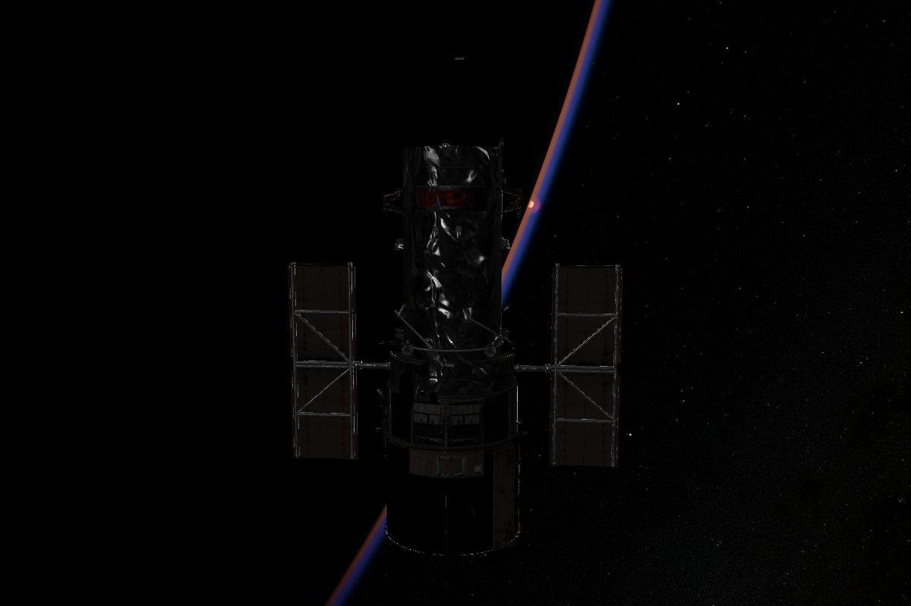](https://spacemap.co/e/20580/Hubble%20Space%20Telescope?at=2026-07-26T11:43:18.534Z,7.05186,38.41685,1.4104e-9) |
| earth | [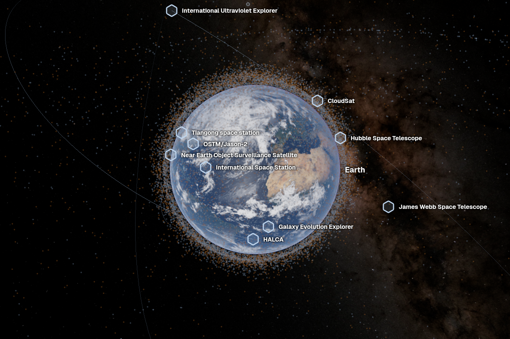](https://spacemap.co/b/399/Earth?at=2026-06-21T14:24:57.661Z,30.63812,-22.71399,0.0023) |
| artemis-2 | [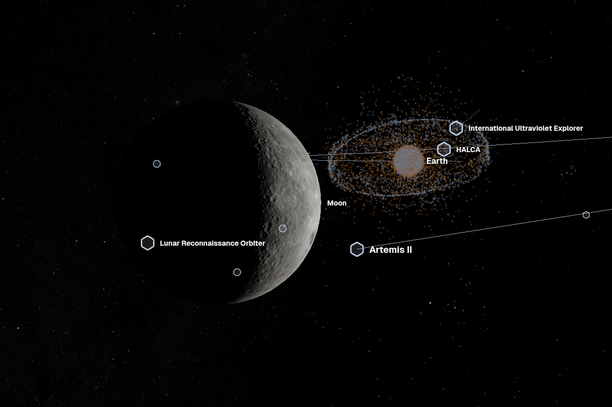](https://spacemap.co/p/121737217/Artemis%20II?at=2026-04-06T22:22:33.709Z,1.5,-14.75,2.9412e-8) |
| mars | [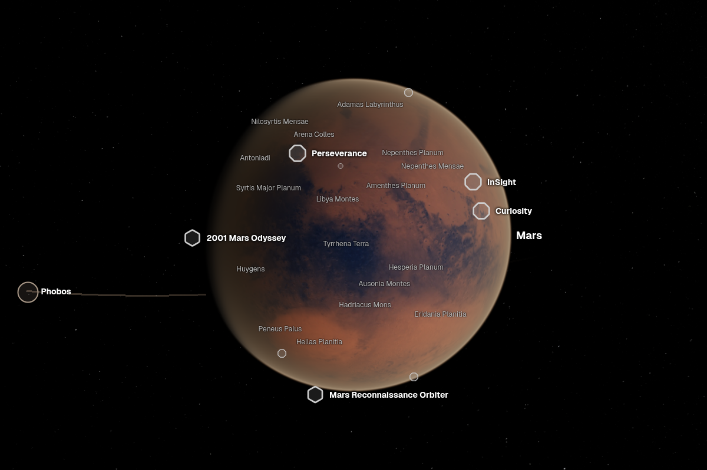](https://spacemap.co/b/499/Mars?at=2026-06-03T05:09:05.427Z,-9.72405,91.33456,0.00093713) |
| curiosity | [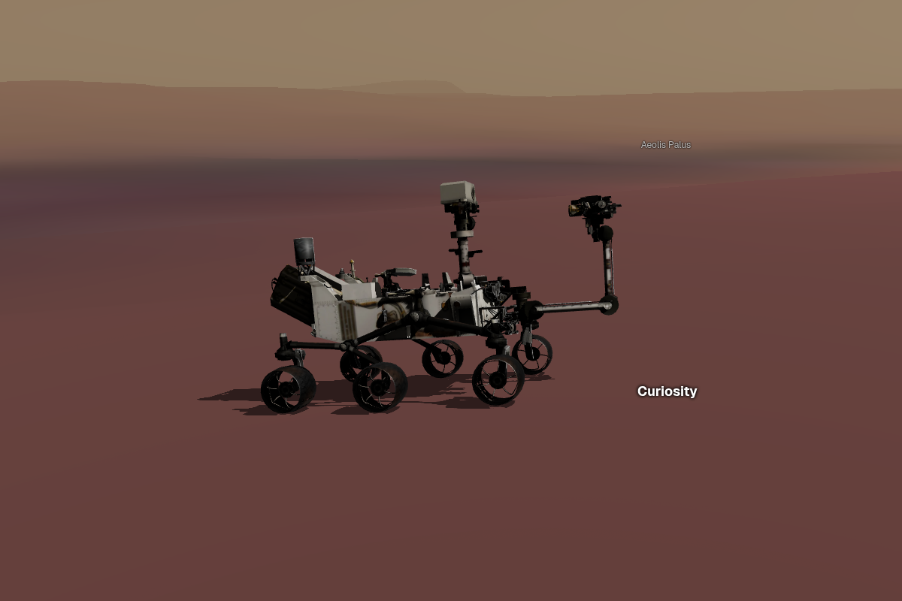](https://spacemap.co/p/100265984/Mars%20Science%20Laboratory?at=2026-07-28T14:17:41.132Z,-52,-72.77,6.016e-10) |
| bennu | [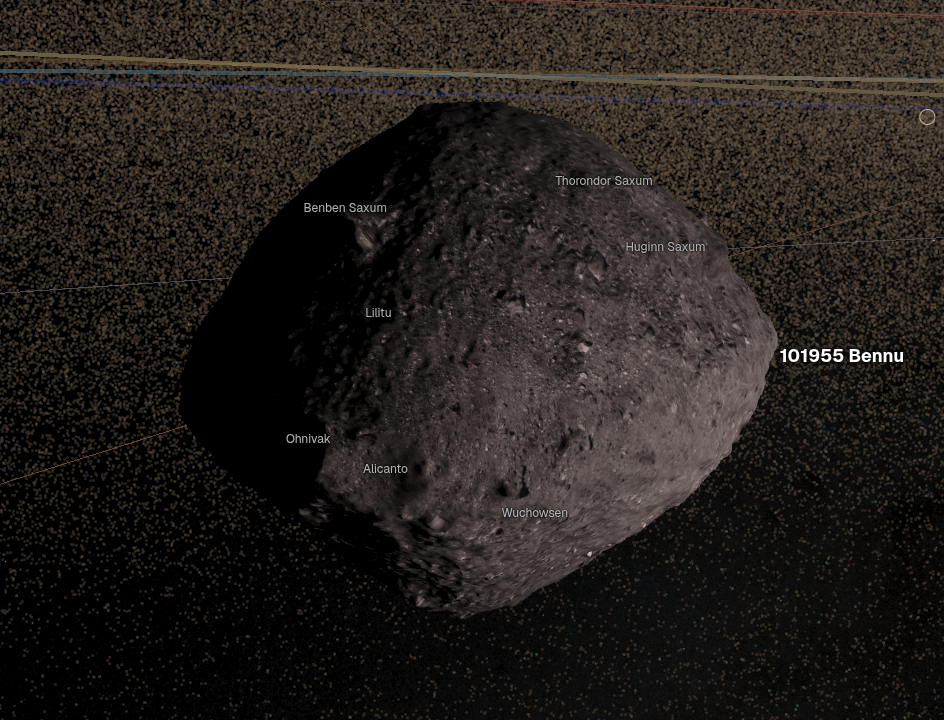](https://spacemap.co/s/20101955/101955%20Bennu?at=now,-16.79942,96.57172,7.6093e-8) |
| juno | [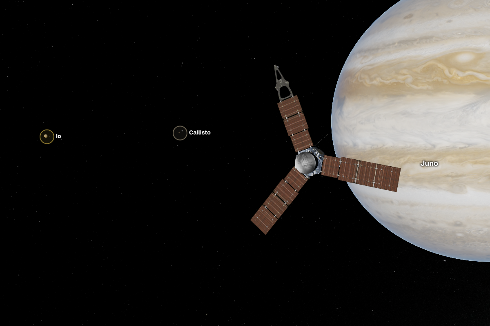](https://spacemap.co/p/107159552/Juno?at=2026-06-03T05:10:21.609Z,3.80217,41.36422,3.3423e-9) |
| saturn | [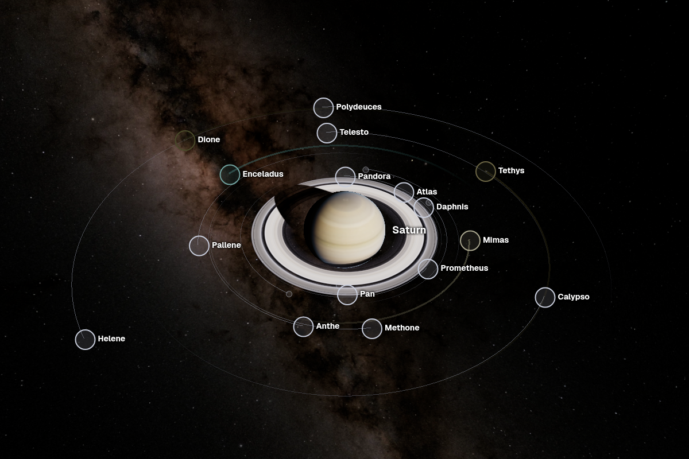](https://spacemap.co/b/699/Saturn?at=2020-06-02T14:10:11.542Z,39.08590,-147.48087,0.06) |
| inner-system | [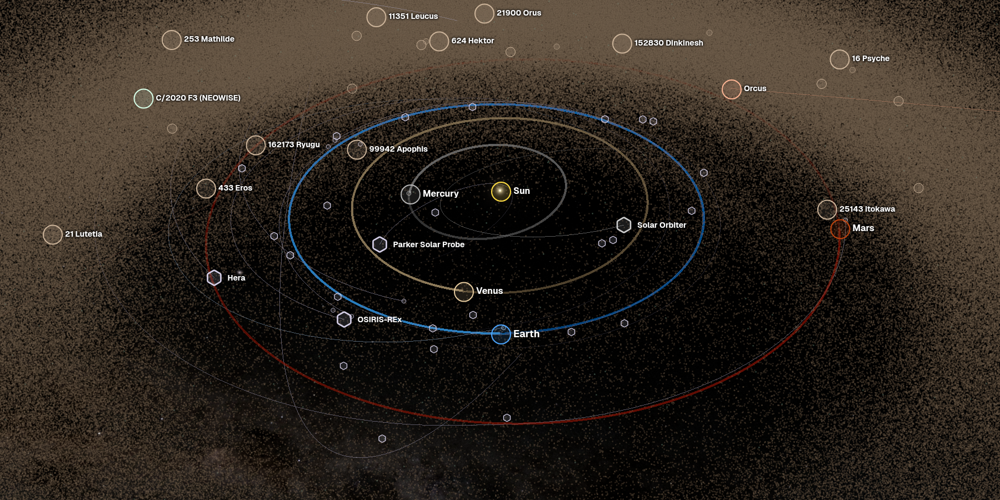](https://spacemap.co/) |
| outer-system | [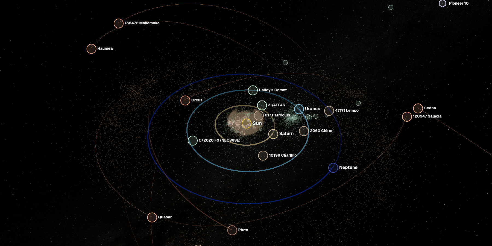](https://spacemap.co/b/10?at=now,46.20563,-166.76342,927.46) |
