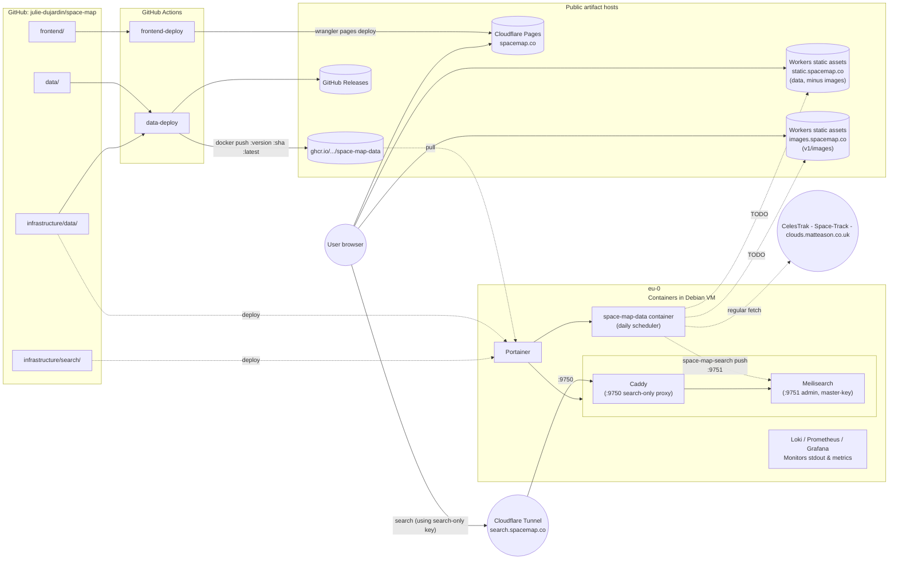

# Infrastructure

```mermaid
flowchart LR
  user((User browser))
  sources((CelesTrak - Space-Track - clouds.matteason.co.uk))
  cftunnel((Cloudflare Tunnel<br/>search.spacemap.co))

  subgraph repo["GitHub: julie-dujardin/space-map"]
    direction TB
    src_fe[frontend/]
    src_data[data/]
    src_infra[infrastructure/data/]
    src_search[infrastructure/search/]
  end

  subgraph ci["GitHub Actions"]
    direction TB
    wf_fe[frontend-deploy]
    wf_data[data-deploy]
  end

  subgraph hosts["Public artifact hosts"]
    direction TB
    cfpagesfront[("Cloudflare Pages<br/>spacemap.co")]
    cfpagesstatic[("Workers static assets<br/>static.spacemap.co<br/>(data, minus images)")]
    cfpagesimages[("Workers static assets<br/>images.spacemap.co<br/>(v1/images)")]
    ghcr[("ghcr.io/.../space-map-data")]
    ghrel[("GitHub Releases")]
  end

  subgraph vm["eu-0<br/>Containers in Debian VM"]
    direction TB
    portainer[Portainer]
    container["space-map-data container<br/>(daily scheduler)"]
    grafana[Loki / Prometheus / Grafana<br/>Monitors stdout & metrics]

    subgraph search["search stack"]
      direction TB
      caddy["Caddy<br/>(:9750 search-only proxy)"]
      meili["Meilisearch<br/>(:9751 admin, master-key)"]
    end
  end

  src_fe --> wf_fe
  src_data --> wf_data
  src_infra --> wf_data
  src_infra -.->|deploy| portainer
  src_search -.->|deploy| portainer

  wf_fe -->|"wrangler pages deploy"| cfpagesfront
  wf_data -->|"docker push :version :sha :latest"| ghcr
  wf_data --> ghrel

  ghcr -.->|pull| portainer
  portainer --> container
  portainer --> search

  container -.->|regular fetch| sources
  container -.->|TODO| cfpagesstatic
  container -.->|TODO| cfpagesimages

  container -.->|"space-map-search push<br/>:9751"| meili
  caddy --> meili

  user --> cfpagesfront
  user --> cfpagesstatic
  user --> cfpagesimages
  user -->|"search (using search-only key)"| cftunnel
  cftunnel -->|":9750"| caddy
```

## EU-0

See [julie-dujardin/homelab](https://github.com/julie-dujardin/homelab) for sources
