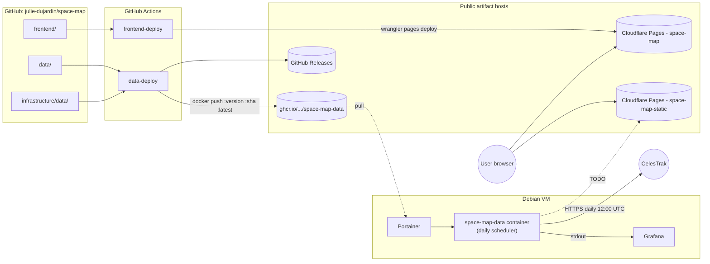

# Infrastructure

- Image tags: `latest`, the version from [`data/pyproject.toml`](../data/pyproject.toml), and the full commit SHA. A matching `vX.Y.Z` GitHub Release is created on first appearance of each version.
